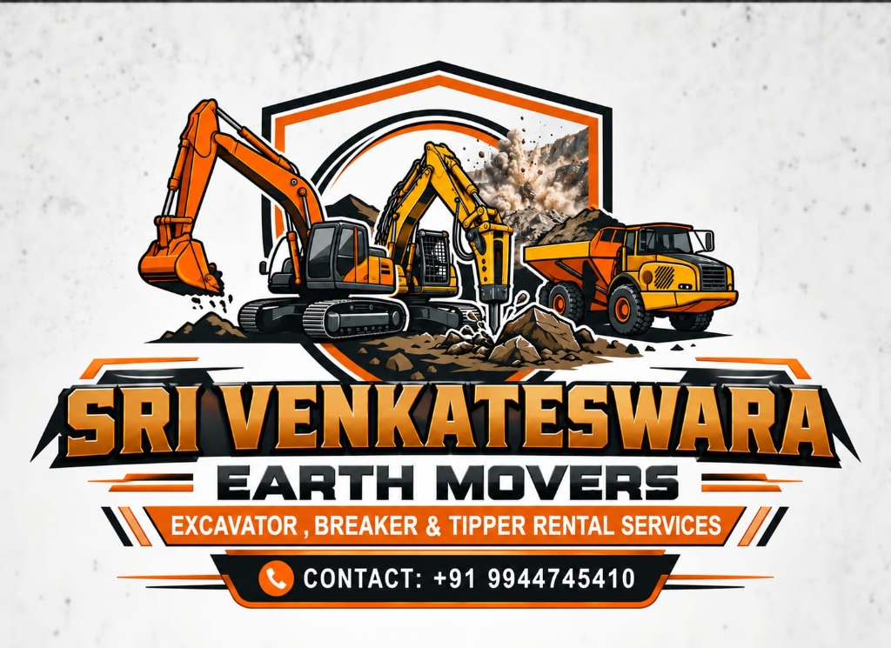

# Sri Venkateshwara Earth Movers

A modern, premium, and fully responsive website for **Sri Venkateshwara Earth Movers** — earth-moving equipment and construction vehicle rentals.



---

## Business Overview

- **Business Name**: Sri Venkateshwara Earth Movers
- **Business Type**: Earth-Moving Equipment & Heavy Construction Vehicle Rental
- **Contact Number**: +91 9944745410
- **Operational Region**: Tamil Nadu & Surrounding Districts

---

## Key Features

1. **Official Brand Logo & Identity**:
   - High-resolution emblem featuring excavator, breaker, and tipper truck.
   - Styled across responsive header, favicon, and footer.
   - Direct phone & WhatsApp links matching official contact credentials.

2. **Hero Section**:
   - Industrial styling with heavy machinery photography.
   - 4-point trust banner: *Well-Maintained Machinery*, *Reliable & Safe Operation*, *Flexible Rental Options*, *Quick Availability & Support*.
   - Direct CTAs to view equipment catalogue and jump to the booking engine.

3. **Fleet Catalogue & In-Depth Details**:
   - 6 machinery categories: **JCB 3DX**, **Crawler Excavator**, **Utility Tractor Tipper**, **Heavy Tipper Lorry**, **Bulldozer**, **Soil Compactor Road Roller**.
   - Real-time availability badges (**Available** in Green / **Currently Rented** in Red).
   - Dedicated specification modal with operating weight, engine power, digging depth, bucket capacities, rental tariffs (hourly, daily, weekly, project-based), and suitable applications.

4. **Interactive Availability Calendar & Booking Engine**:
   - Interactive calendar reflecting equipment availability.
   - Real-time conflict detection: selecting booked dates immediately displays unavailable alerts and blocks invalid submissions.
   - Range validation ensuring end date is after start date and prevents overlapping bookings.
   - Generates a booking request with reference tracking ID and confirmation dialog.

5. **Direct Owner Contact & WhatsApp Integration**:
   - Dynamic WhatsApp enquiry generator that pre-fills selected machine and requested dates.
   - One-click phone call buttons and floating bottom-right WhatsApp button.

6. **Services, Gallery & Reviews**:
   - 5 core service offerings: *Earth Excavation*, *Earth Filling*, *Road Work*, *Demolition Work*, *Land Development*.
   - Worksite photography gallery with full-screen lightbox navigation.
   - Testimonial slider featuring customer ratings.
   - Yard address, operational hours, 24/7 breakdown assistance, and embedded Google Maps.

---

## Tech Stack

- **Framework**: React 19
- **Bundler & Dev Server**: Vite
- **Language**: TypeScript
- **Icons**: Lucide React
- **Styling**: Modular Responsive CSS (mobile-first, zero horizontal overflow)
- **Linter**: Oxlint

---

## Getting Started

### Prerequisites

- Node.js (v18+ recommended)
- npm (v9+ recommended)

### Installation

```bash
git clone https://github.com/Aravind0511/SriVenkateswara-Earth-Movers.git
cd SriVenkateswara-Earth-Movers
npm install
```

### Development Server

Start the local development server:

```bash
npm run dev
```

### Production Build

Type-check and bundle for production:

```bash
npm run build
```

### Run Linter

```bash
npm run lint
```

---

## Project Structure

```text
├── public/
│   ├── favicon.svg
│   ├── icons.svg
│   └── logo.jpg               # Official business logo
├── src/
│   ├── assets/
│   │   └── logo.jpg
│   ├── components/
│   │   ├── AvailabilityCalendar.tsx
│   │   ├── BookingConfirmationModal.tsx
│   │   ├── BookingSection.tsx
│   │   ├── ContactSection.tsx
│   │   ├── EquipmentCard.tsx
│   │   ├── EquipmentModal.tsx
│   │   ├── EquipmentSection.tsx
│   │   ├── FloatingWhatsApp.tsx
│   │   ├── Footer.tsx
│   │   ├── FooterCTA.tsx
│   │   ├── GalleryLightbox.tsx
│   │   ├── GallerySection.tsx
│   │   ├── Header.tsx
│   │   ├── Hero.tsx
│   │   ├── HowItWorks.tsx
│   │   ├── Logo.tsx
│   │   ├── ReviewsSection.tsx
│   │   ├── ServicesSection.tsx
│   │   ├── WhyChooseUs.tsx
│   │   └── WorkAndReviewsSection.tsx
│   ├── config/
│   │   └── businessInfo.ts    # Centralized business data & contacts
│   ├── data/
│   │   ├── equipmentData.ts
│   │   ├── galleryData.ts
│   │   ├── initialBookings.ts
│   │   ├── reviewsData.ts
│   │   └── servicesData.ts
│   ├── types/
│   │   └── index.ts
│   ├── utils/
│   │   └── dateUtils.ts
│   ├── App.css
│   ├── App.tsx
│   ├── index.css
│   └── main.tsx
├── scripts/
│   └── verify-logic.ts        # Automated logic verification test suite
├── index.html
├── package.json
├── tsconfig.json
└── vite.config.ts
```
